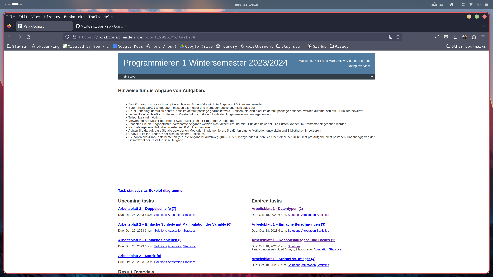
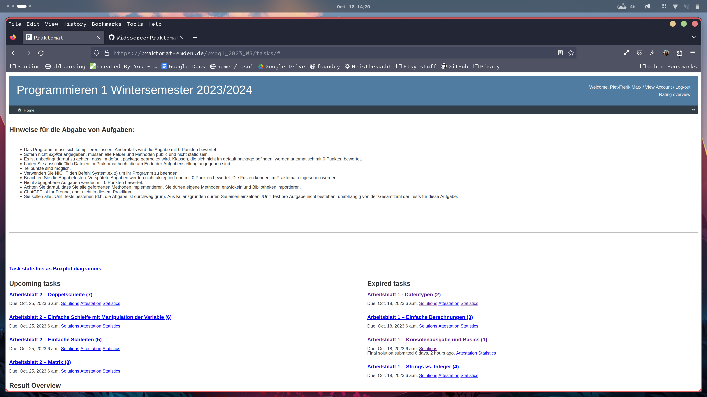
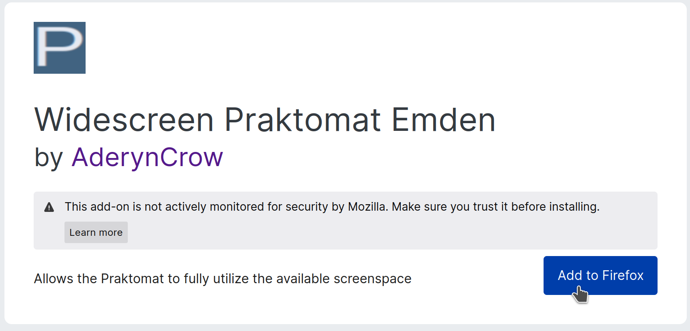
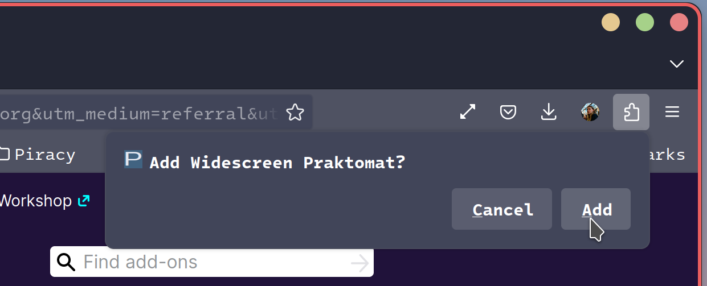
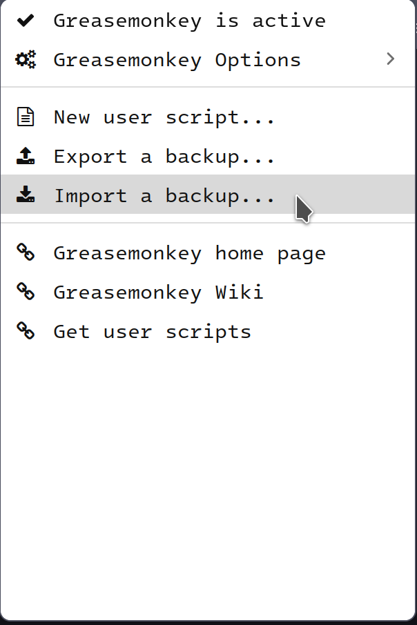
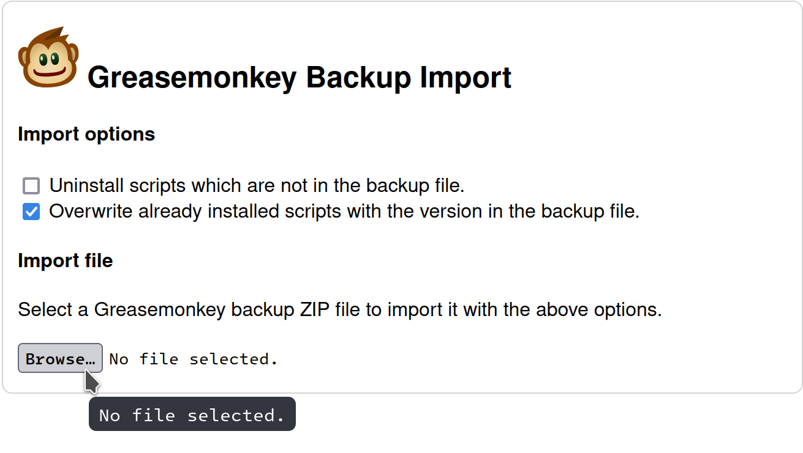
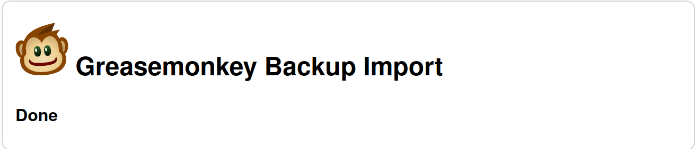

# Feature:
Entfernt die Weißen Ränder und gibt den Elementen mehr Platz
## vorher:

## nachher:

# Installation:
Bisher ist das addon nur für Firefox, Opera beta und Opera developer verfügbar. 
Für andere Browser ist ein Userscript verfügbar 
Bei Fragen bin ich unter piet-frerik.marx@stud.hs-emden-leer.de erreichbar
## Firefox:
1. Klicke auf diesen [Link](https://addons.mozilla.org/en-US/firefox/addon/widescreen-praktomat-emden/?utm_source=addons.mozilla.org&utm_medium=referral&utm_content=search) um auf den offiziellen Firefox addon store zu kommen.
2. Drücke den "add to firefox" Link

3. Bestätige es im popup oben rechts

4. Fertig!
## Opera, chrome, Edge, etc...
1. Lade die [Zip datei](https://github.com/AderynCrow/WidescreenPraktomatExtension/raw/main/WidescreenPraktomat.zip) herunter
2. Instaliere ein Userscript addon. Beispielsweise greasemonkey oder tamppermonkey
3. Öffne das Addon

4. Wähle "Import Backup"

5. Wähle die Zip datei aus

6. Fertig!

